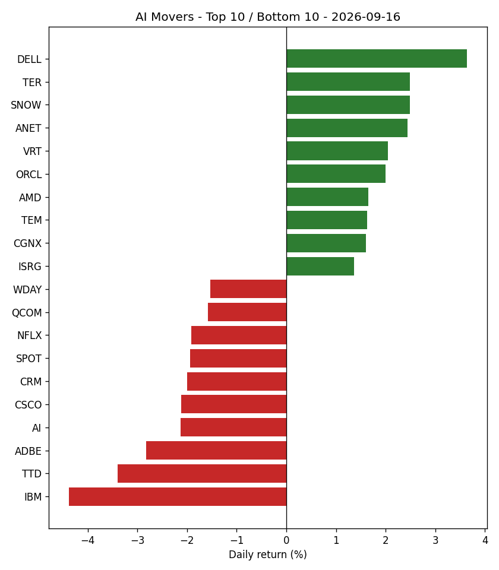

# AI Movers Daily Recap – September 16, 2026

## Market Overview
Across the 50 AI-related stocks tracked, market breadth was negative with 21 stocks advancing and 29 declining. The benchmark S&P 500 (SPY) returned -0.44% for the day.

## Theme Performance

### Top Themes
1. **AI Networking & Data Center Infrastructure** (Rank 1): +1.38% today (-1.09% over 5 days)
2. **Robotics & Industrial Automation** (Rank 2): +1.15% today (-1.44% over 5 days)
3. **AI Chips & Semiconductors** (Rank 3): +0.30% today (-3.66% over 5 days)
4. **Healthcare AI** (Rank 4): +0.15% today (+5.10% over 5 days)
5. **AI Data & Analytics** (Rank 5): +0.02% today (+1.45% over 5 days)

### Bottom Themes
1. **Consumer Internet & AI Platforms** (Rank 10): -1.48% today (+2.92% over 5 days)
2. **Enterprise AI Software** (Rank 9): -1.36% today (+2.26% over 5 days)
3. **Cloud & AI Infrastructure** (Rank 8): -1.07% today (-2.32% over 5 days)
4. **Autonomous Vehicles & Mobility AI** (Rank 7): -0.74% today (-1.65% over 5 days)
5. **Cybersecurity AI** (Rank 6): -0.64% today (+14.41% over 5 days)

## Top Performing AI Stocks
1. **DELL** (Rank 1): Closed at $563.29 (+3.64% today, +5.24% 5-day trend). Daily range: $550.09 – $576.75 | Volume: 13,108,085
2. **TER** (Rank 2): Closed at $341.15 (+2.49% today, -11.09% 5-day trend). Daily range: $336.57 – $347.00 | Volume: 2,550,160
3. **SNOW** (Rank 3): Closed at $331.02 (+2.49% today, -0.14% 5-day trend). Daily range: $317.45 – $338.00 | Volume: 3,762,371
4. **ANET** (Rank 4): Closed at $197.54 (+2.44% today, +2.39% 5-day trend). Daily range: $195.08 – $200.25 | Volume: 4,475,467
5. **VRT** (Rank 5): Closed at $239.41 (+2.05% today, -8.93% 5-day trend). Daily range: $237.64 – $244.76 | Volume: 5,514,637
6. **ORCL** (Rank 6): Closed at $143.16 (+2.00% today, -11.43% 5-day trend). Daily range: $139.00 – $146.52 | Volume: 34,366,403
7. **AMD** (Rank 7): Closed at $512.5 (+1.65% today, -1.65% 5-day trend). Daily range: $506.05 – $527.25 | Volume: 22,317,674
8. **TEM** (Rank 8): Closed at $69.97 (+1.63% today, +14.18% 5-day trend). Daily range: $68.42 – $71.48 | Volume: 7,585,840
9. **CGNX** (Rank 9): Closed at $60.1 (+1.61% today, -2.86% 5-day trend). Daily range: $59.35 – $60.99 | Volume: 1,418,332
10. **ISRG** (Rank 10): Closed at $382.29 (+1.36% today, +8.22% 5-day trend). Daily range: $377.16 – $387.29 | Volume: 2,135,005

## Bottom Performing AI Stocks
1. **IBM** (Rank 50): Closed at $237.49 (-4.38% today, -1.02% 5-day trend). Daily range: $235.41 – $243.34 | Volume: 6,181,839
2. **TTD** (Rank 49): Closed at $14.49 (-3.40% today, +4.39% 5-day trend). Daily range: $14.47 – $14.97 | Volume: 14,971,993
3. **ADBE** (Rank 48): Closed at $250.5 (-2.82% today, -1.71% 5-day trend). Daily range: $249.27 – $254.98 | Volume: 4,476,062
4. **AI** (Rank 47): Closed at $10.56 (-2.13% today, +1.73% 5-day trend). Daily range: $10.35 – $10.75 | Volume: 4,479,226
5. **CSCO** (Rank 46): Closed at $107.74 (-2.12% today, -1.54% 5-day trend). Daily range: $107.55 – $110.99 | Volume: 15,563,778
6. **CRM** (Rank 45): Closed at $250.54 (-2.00% today, +2.61% 5-day trend). Daily range: $249.60 – $256.40 | Volume: 9,432,373
7. **SPOT** (Rank 44): Closed at $547.43 (-1.94% today, +4.67% 5-day trend). Daily range: $546.01 – $564.89 | Volume: 1,546,825
8. **NFLX** (Rank 43): Closed at $76.41 (-1.91% today, +0.50% 5-day trend). Daily range: $76.31 – $77.80 | Volume: 25,376,274
9. **QCOM** (Rank 42): Closed at $184.84 (-1.58% today, +4.78% 5-day trend). Daily range: $183.37 – $191.28 | Volume: 9,718,616
10. **WDAY** (Rank 41): Closed at $187.76 (-1.53% today, +0.92% 5-day trend). Daily range: $186.32 – $189.91 | Volume: 1,926,945

