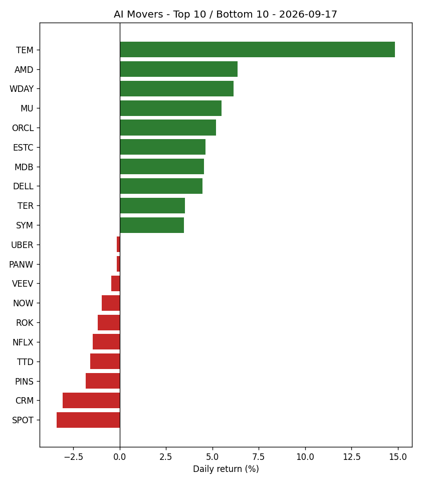

# AI Market Recap - 2026-09-17

## Market Overview

Market breadth showed 40 stocks up, 10 down, and 0 flat out of 50 total stocks tracked, while the S&P 500 (SPY) returned +1.13%.

## Top Themes

Healthcare AI led the top themes with a +4.59% return as it moved from rank 4 to rank 1, while AI Chips & Semiconductors returned +3.63%.

| Theme | Return | 5d Trend | Rank | Prev Rank |
|---|---|---|---|---|
| Healthcare AI | +4.59% | +11.43% | 1 | 4 |
| AI Chips & Semiconductors | +3.63% | +2.03% | 2 | 3 |
| AI Data & Analytics | +3.15% | +4.77% | 3 | 5 |
| Cloud & AI Infrastructure | +2.05% | +1.06% | 4 | 8 |
| AI Networking & Data Center Infrastructure | +1.92% | +4.37% | 5 | 1 |

## Bottom Themes

Consumer Internet & AI Platforms lagged with a return of -1.38% as it held rank 10, while Enterprise AI Software returned +0.81%.

| Theme | Return | 5d Trend | Rank | Prev Rank |
|---|---|---|---|---|
| Consumer Internet & AI Platforms | -1.38% | +1.18% | 10 | 10 |
| Enterprise AI Software | +0.81% | +4.19% | 9 | 9 |
| Cybersecurity AI | +1.05% | +14.99% | 8 | 6 |
| Robotics & Industrial Automation | +1.48% | +1.26% | 7 | 2 |
| Autonomous Vehicles & Mobility AI | +1.67% | -1.52% | 6 | 7 |

## Top Stocks

TEM was the top performing stock with a return of +14.85%, moving from rank 8 to rank 1, while AMD gained +6.36%.

| Ticker | Theme | Return | 5d Trend | High | Low | Volume | Rank | Prev Rank |
|---|---|---|---|---|---|---|---|---|
| TEM | Healthcare AI | +14.85% | +36.81% | $81.28 | $72.61 | 17,128,001 | 1 | 8 |
| AMD | AI Chips & Semiconductors | +6.36% | +8.24% | $551.42 | $527.60 | 28,471,628 | 2 | 7 |
| WDAY | Enterprise AI Software | +6.14% | +7.67% | $201.00 | $183.60 | 4,253,216 | 3 | 41 |
| MU | AI Chips & Semiconductors | +5.50% | +0.01% | $986.20 | $953.50 | 22,091,591 | 4 | 22 |
| ORCL | Cloud & AI Infrastructure | +5.19% | -1.54% | $152.00 | $146.15 | 27,742,416 | 5 | 6 |
| ESTC | AI Data & Analytics | +4.63% | +6.58% | $89.73 | $83.81 | 1,997,770 | 6 | 23 |
| MDB | AI Data & Analytics | +4.54% | +5.23% | $403.00 | $372.00 | 1,546,005 | 7 | 25 |
| DELL | AI Networking & Data Center Infrastructure | +4.46% | +16.14% | $593.98 | $565.50 | 9,350,698 | 8 | 1 |
| TER | Robotics & Industrial Automation | +3.51% | -4.61% | $360.26 | $350.00 | 2,598,552 | 9 | 2 |
| SYM | Robotics & Industrial Automation | +3.48% | +8.54% | $45.55 | $43.92 | 2,365,687 | 10 | 15 |

## Bottom Stocks

SPOT was the lowest performing stock with a -3.40% return, dropping from rank 44 to rank 50, followed by CRM at -3.07%.

| Ticker | Theme | Return | 5d Trend | High | Low | Volume | Rank | Prev Rank |
|---|---|---|---|---|---|---|---|---|
| SPOT | Consumer Internet & AI Platforms | -3.40% | +1.36% | $553.77 | $528.71 | 1,284,098 | 50 | 44 |
| CRM | Enterprise AI Software | -3.07% | -0.06% | $247.00 | $241.52 | 16,611,316 | 49 | 45 |
| PINS | Consumer Internet & AI Platforms | -1.82% | -2.50% | $18.81 | $18.20 | 29,471,591 | 48 | 28 |
| TTD | Consumer Internet & AI Platforms | -1.59% | +2.08% | $14.87 | $14.21 | 18,371,788 | 47 | 49 |
| NFLX | Consumer Internet & AI Platforms | -1.44% | -0.92% | $76.96 | $75.30 | 28,167,578 | 46 | 43 |
| ROK | Robotics & Industrial Automation | -1.17% | -2.69% | $424.24 | $406.92 | 990,557 | 45 | 27 |
| NOW | Enterprise AI Software | -0.97% | +5.57% | $140.54 | $136.00 | 9,857,075 | 44 | 40 |
| VEEV | Healthcare AI | -0.43% | +1.06% | $266.71 | $260.45 | 1,120,870 | 43 | 31 |
| PANW | Cybersecurity AI | -0.16% | +10.80% | $383.12 | $360.66 | 6,294,772 | 42 | 20 |
| UBER | Autonomous Vehicles & Mobility AI | -0.14% | -2.33% | $71.64 | $70.24 | 19,808,395 | 41 | 30 |

