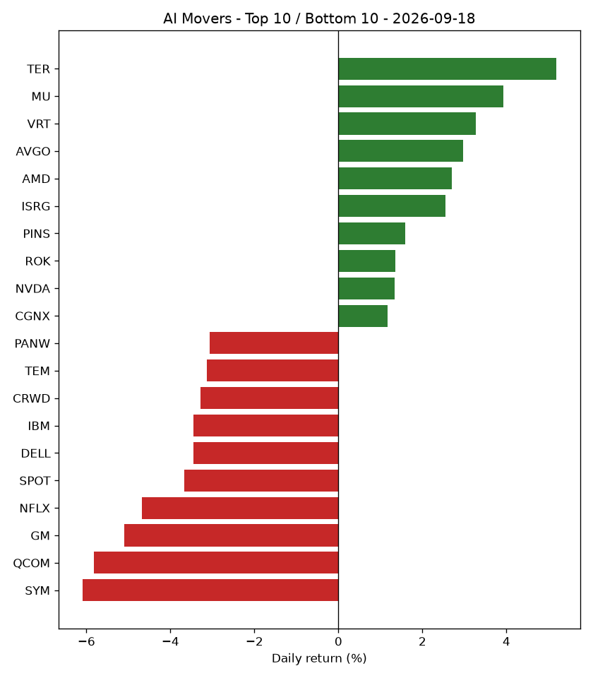

# AI Market Recap - 2026-09-18

## Market Overview

Market breadth showed 14 stocks up, 36 down, and 0 flat out of 50 total stocks tracked, while the S&P 500 (SPY) returned -0.12%.

## Top Themes

AI Chips & Semiconductors moved from rank 2 to rank 1 with a return of +1.02%, while Robotics & Industrial Automation returned +0.83%.

| Theme | Return | 5d Trend | Rank | Prev Rank |
|---|---|---|---|---|
| AI Chips & Semiconductors | +1.02% | +1.87% | 1 | 2 |
| Robotics & Industrial Automation | +0.83% | -0.66% | 2 | 7 |
| AI Networking & Data Center Infrastructure | -0.27% | -1.37% | 3 | 5 |
| Cloud & AI Infrastructure | -0.92% | -1.15% | 4 | 4 |
| Autonomous Vehicles & Mobility AI | -1.29% | -2.60% | 5 | 6 |

## Bottom Themes

AI Data & Analytics returned -2.38% and moved from rank 3 to rank 10, while Consumer Internet & AI Platforms returned -2.31%.

| Theme | Return | 5d Trend | Rank | Prev Rank |
|---|---|---|---|---|
| AI Data & Analytics | -2.38% | +2.92% | 10 | 3 |
| Consumer Internet & AI Platforms | -2.31% | -2.58% | 9 | 10 |
| Cybersecurity AI | -2.19% | +13.52% | 8 | 8 |
| Healthcare AI | -1.67% | +8.37% | 7 | 1 |
| Enterprise AI Software | -1.52% | +1.51% | 6 | 9 |

## Top Stocks

TER led top stocks with a return of +5.19%, moving from rank 9 to rank 1, followed by MU with a return of +3.92%.

| Ticker | Theme | Return | 5d Trend | High | Low | Volume | Rank | Prev Rank |
|---|---|---|---|---|---|---|---|---|
| TER | Robotics & Industrial Automation | +5.19% | -2.17% | $371.71 | $356.97 | 4,291,915 | 1 | 9 |
| MU | AI Chips & Semiconductors | +3.92% | +4.16% | $1016.44 | $977.83 | 35,723,370 | 2 | 4 |
| VRT | AI Networking & Data Center Infrastructure | +3.27% | -2.98% | $250.15 | $242.43 | 7,834,088 | 3 | 34 |
| AVGO | AI Chips & Semiconductors | +2.97% | -1.21% | $363.28 | $351.33 | 44,007,576 | 4 | 18 |
| AMD | AI Chips & Semiconductors | +2.70% | +8.46% | $559.91 | $541.53 | 31,835,108 | 5 | 2 |
| ISRG | Robotics & Industrial Automation | +2.55% | +6.55% | $394.91 | $379.50 | 4,929,476 | 6 | 38 |
| PINS | Consumer Internet & AI Platforms | +1.58% | -2.36% | $18.82 | $18.25 | 33,618,319 | 7 | 48 |
| ROK | Robotics & Industrial Automation | +1.36% | -2.98% | $415.64 | $407.47 | 1,099,746 | 8 | 45 |
| NVDA | AI Chips & Semiconductors | +1.34% | +1.82% | $222.73 | $218.03 | 190,228,287 | 9 | 15 |
| CGNX | Robotics & Industrial Automation | +1.17% | -4.14% | $61.82 | $60.97 | 1,904,494 | 10 | 30 |

## Bottom Stocks

SYM fell -6.10%, moving from rank 10 to rank 50, while QCOM returned -5.82%.

| Ticker | Theme | Return | 5d Trend | High | Low | Volume | Rank | Prev Rank |
|---|---|---|---|---|---|---|---|---|
| SYM | Robotics & Industrial Automation | -6.10% | -0.57% | $44.86 | $41.60 | 3,922,831 | 50 | 10 |
| QCOM | AI Chips & Semiconductors | -5.82% | -2.34% | $192.12 | $175.97 | 54,346,161 | 49 | 23 |
| GM | Autonomous Vehicles & Mobility AI | -5.10% | -3.99% | $86.49 | $81.39 | 21,147,033 | 48 | 14 |
| NFLX | Consumer Internet & AI Platforms | -4.67% | -7.25% | $72.38 | $70.11 | 114,367,532 | 47 | 46 |
| SPOT | Consumer Internet & AI Platforms | -3.67% | -3.10% | $527.57 | $508.50 | 1,763,999 | 46 | 50 |
| DELL | AI Networking & Data Center Infrastructure | -3.46% | +0.14% | $595.51 | $568.06 | 11,722,893 | 45 | 8 |
| IBM | Cloud & AI Infrastructure | -3.45% | -5.65% | $237.89 | $229.38 | 13,406,502 | 44 | 39 |
| CRWD | Cybersecurity AI | -3.28% | +14.95% | $247.50 | $234.90 | 19,457,952 | 43 | 25 |
| TEM | Healthcare AI | -3.14% | +31.91% | $81.83 | $75.99 | 9,317,993 | 42 | 1 |
| PANW | Cybersecurity AI | -3.06% | +9.96% | $376.01 | $356.00 | 13,798,787 | 41 | 42 |

